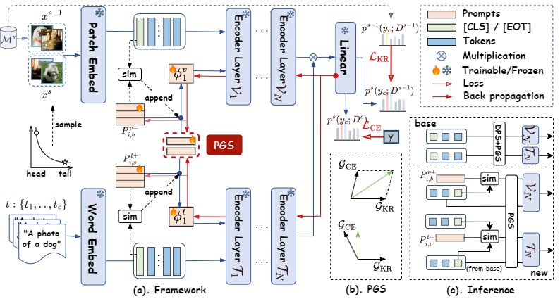

# 🔥 PromptLT: Long-tailed Multimodal Prompt Learning 🔥

This is the source code for the paper: PromptLT: Long-tailed Multimodal Prompt Learning.

    

##### I feel really sorry that images as well as some paragraphs in the main paper have writing problems. I spent too much time on the appendix, innumerable workload makes me fail to double-check the paper. 
Some modifications here:
1. line 147: head-new -> head-base
2. line 154: tail-based -> tail-base
3. Equation 8: exchange t+ and v+
4. line 151: unlabeled base classes ~~and new tail-base samples~~ can then naturally ...
5. EOF-token -> EOT-token

##### Thanks for your caring!

## What's New:
2025.5 We release the code !

## Install

This code is built on top of the codebase for [CoOp](https://github.com/KaiyangZhou/CoOp) and [Candle](https://github.com/shijxcs/Candle/). Please follow their instructions to prepare the required environments and datasets.

## Run
Please refer to the running scripts under `scripts/promptlt` for different experimental settings.  

Make sure to change the path of `DATA` in corresponding scripts and run the commands under the main directory.  

In `run_example.sh`, I provide some examples on how to run the model.
